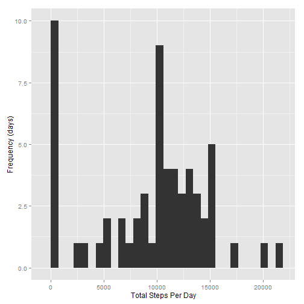
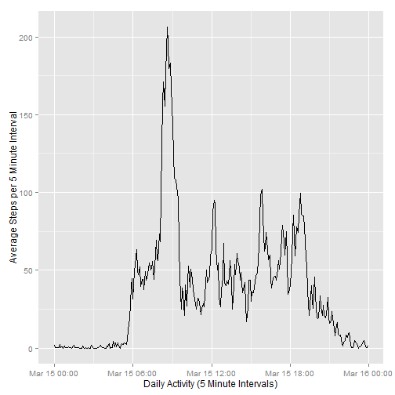
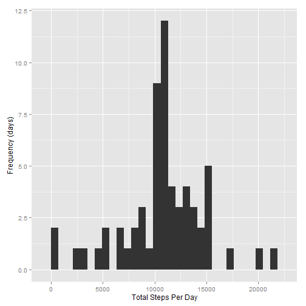
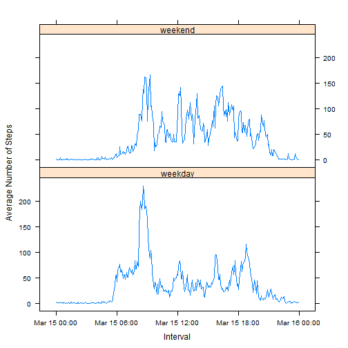

## Prerequisite Packages


```r
require(data.table)
require(ggplot2)
require(lubridate)
require(plyr)
require(chron)
require(lattice)
```

## Loading and preprocessing the data

Load data into our initial data table:

```r
download.file("https://d396qusza40orc.cloudfront.net/repdata%2Fdata%2Factivity.zip", "repdata_data_activity.zip")
unzip("repdata_data_activity.zip")
data <- fread("activity.csv")
```

Format our date column and calculate days of week and weekdays

```r
data$date <- as.Date(data$date, format="%Y-%m-%d")
data$day<-wday(data$date, label = TRUE, abbr = FALSE)
data$weekend_logical <- is.weekend(data$date)
```

Count total steps per day

```r
data_summary <- data[, list(total_steps = sum(steps, na.rm = TRUE)), by = date]
```

## What is mean total number of steps taken per day?

Plot histogram of the frequency of steps per day, using default 30 segment bins

```r
qplot(data_summary$total_steps, xlab = "Total Steps Per Day", ylab = "Frequency (days)", geom = "histogram")
```

 

Find the mean steps per day, rounded to nearest whole step

```r
mean_steps = round(mean(data_summary$total_steps, na.rm=TRUE))
print(mean_steps)
```

```
## [1] 9354
```

Find the median steps per day, rounded to nearest whole step

```r
median_steps = round(median(data_summary$total_steps, na.rm=TRUE))
print(median_steps)
```

```
## [1] 10395
```

## What is the average daily activity pattern?

Count average steps per interval

```r
data_summary_interval <- data[, list(avg_steps = mean(steps, na.rm = TRUE)), by = interval]
```

Generate complete time scale to account for missing observations and transform it into a POSIXct class

```r
intervals <- as.POSIXct(strptime(sprintf("%04d", as.numeric(data_summary_interval$interval)), format="%H%M"))
```

Plot average steps per interval across the day

```r
qplot(intervals,
      data_summary_interval$avg_steps,
      xlab = "Daily Activity (5 Minute Intervals)",
      ylab = "Average Steps per 5 Minute Interval",
      geom = "line",
)
```

 

Return the interval in which the highest average number of steps were taken (835) and also return the average steps in that interval (206)

```r
data_summary_interval[which.max(data_summary_interval$avg_steps), ]
```

```
##    interval avg_steps
## 1:      835  206.1698
```

## Imputing missing values

Calculate the number of rows with missing data

```r
na_index = is.na(data$steps)
sum(na_index)
```

```
## [1] 2304
```
Gives us 2304 rows with missing data  
To verify, we can examine our index and see that there are 15264 complete records

```r
summary(na_index)
```

```
##    Mode   FALSE    TRUE    NA's 
## logical   15264    2304       0
```

For each record with no value, find the average for that interval and replace the NA with the mean for all other valid entries for that interval, rounded up

```r
stepValues <- data.frame(data$steps)
stepValues[is.na(stepValues),] <- ceiling(tapply(X = data$steps,
                                                 INDEX=data$interval
                                                 ,FUN=mean,na.rm=TRUE
                                                 )
                                          )
newData <- cbind(stepValues, data$date, data$interval, data$day, data$weekend_logical)
colnames(newData) <- c("steps", "date", "interval", "day", "weekend_logical")
```

Count total steps per day for our new smoothed data

```r
newData_total <- aggregate(newData$steps, list(newData$date), sum)
colnames(newData_total) <- c("date", "steps")
newData_total$date <- as.Date(newData_total$date, format="%Y-%m-%d")
```

Plot our new smoothed data

```r
qplot(newData_total$steps, xlab = "Total Steps Per Day", ylab = "Frequency (days)", geom = "histogram")
```

 

Mean of smoothed data, rounded up

```r
mean_steps_smoothed <- round(mean(newData_total$steps))
print(mean_steps_smoothed)
```

```
## [1] 10785
```

Median of smoothed data, rounded up

```r
median_steps_smoothed <- round(median(newData_total$steps))
print(median_steps_smoothed)
```

```
## [1] 10909
```

Our smoothing of the NA values has increased both mean and median steps  
Mean steps increased by 1431:

```r
diff(c(mean_steps, mean_steps_smoothed))
```

```
## [1] 1431
```
Median steps increased by 514:

```r
diff(c(median_steps, median_steps_smoothed))
```

```
## [1] 514
```
Imputing values reduced the distortion caused by the lack of measurements, presenting a more realistic picture of total steps per day


## Are there differences in activity patterns between weekdays and weekends?

Break apart smoothed data into weekday and weekend subsets, then average steps per interval

```r
newData$daytype <- ifelse(newData$weekend_logical == TRUE, "weekend", "weekday")

newData_avg_day_type <- aggregate(
        data = newData,
        steps ~ daytype + interval,
        FUN = mean
)
```

Prepare intervals for time scaling in plot

```r
newData_avg_day_type <- (
        transform(newData_avg_day_type,
                  interval_time = strptime(sprintf("%04d", interval), "%H%M"))
)
```
Plot average steps per interval split out by weekday vs. weekend  
Higher afternoon and evening activity on weekends  
Higher morning activity on weekdays

```r
xyplot(
        type="l",
        data=newData_avg_day_type,
        steps ~ interval_time | daytype,
        xlab="Interval",
        ylab="Average Number of Steps",
        layout=c(1,2)
)
```

 
